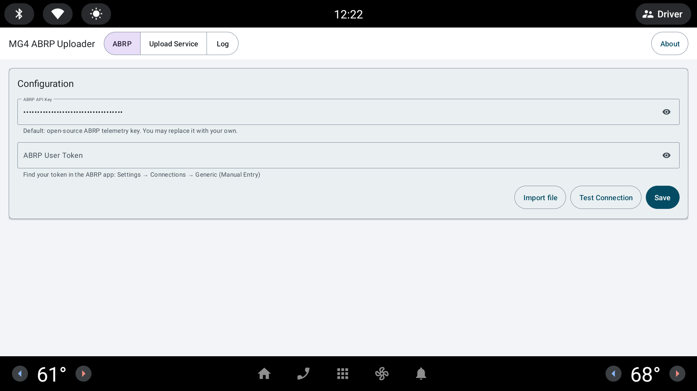

[Source code](https://github.com/malys/MG4AbrpUploader) · [Releases](https://github.com/malys/MG4AbrpUploader/releases) · [Issue tracker](https://github.com/malys/MG4AbrpUploader/issues)

Choose MG4 ABRP Uploader when you use A Better Routeplanner and want it to receive live data
from the car. The app reads telemetry and location, sends available values to ABRP, and
never changes a vehicle setting.

## What ABRP can receive

Depending on firmware and available AAOS properties, payloads can include state of charge,
estimated range, speed, outside temperature, charging state and rate, cabin temperature,
position, elevation, and heading. Battery state and range support are firmware-specific.

## Privacy and network use

ABRP telemetry is the suite's intentional network-facing function. Review the project's
privacy documentation, use your own ABRP token, and disable the service when you no longer
want live telemetry sent.

## Get started

1. [Install the APK](/MG4Suite/tutorial/sideload/).
2. [Add your API key and user token, then understand upload errors](/MG4Suite/tutorial/abrp/).
