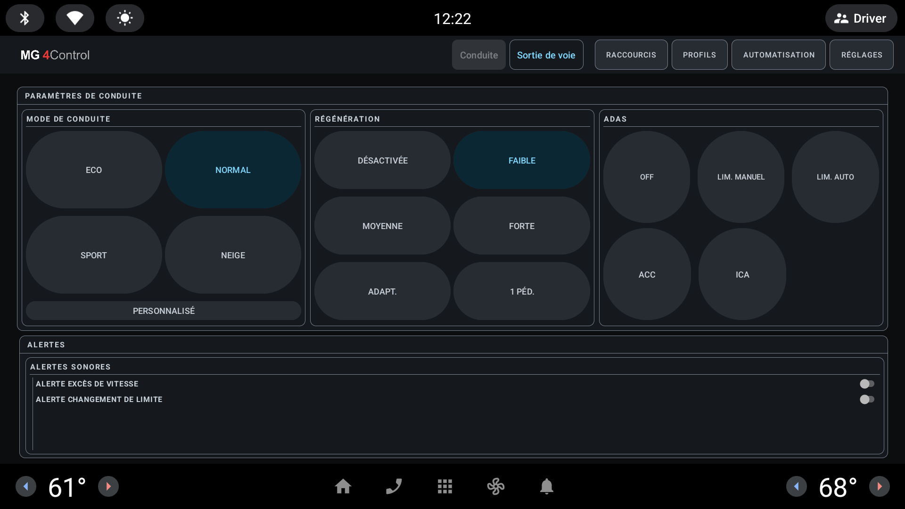

[Source code](https://github.com/malys/EVProfile) · [Releases](https://github.com/malys/EVProfile/releases) · [Issue tracker](https://github.com/malys/EVProfile/issues)

Choose EVProfile when you want one place to adjust supported vehicle settings or save a
group of settings as a reusable profile.

## What you can do

- Changes supported driving mode, regeneration, one-pedal, heating, and ADAS settings
- Saves and applies named profiles
- See which settings the app can use on the detected firmware
- Understand why a change was refused
- Open EVTasker when you want to automate an action

## What to expect

EVProfile can read and change vehicle settings. Changes that affect road behaviour are
accepted only while the app can confirm the car is at 0 km/h. Park before making changes
and confirm the result on the vehicle.

The emulator uses an unsupported synthetic firmware ID, so this screenshot shows EVProfile's
explicit compatibility mode. It demonstrates layout only; it does not prove that a setting
is available on a particular car.

## Get started

1. [Read the installation safety notes](/EVSuite_site/start/safety/).
2. Download a signed stable APK from [EVProfile Releases](https://github.com/malys/EVProfile/releases).
3. [Install the APK on the head unit](/EVSuite_site/tutorial/sideload/).
4. Open EVProfile while parked and review the detected firmware before changing a setting.
5. [Create and test your first driving profile](/EVSuite_site/tutorial/profile/).

## Automation and shortcuts

EVProfile can hand a saved profile to EVTasker, and can assign actions to short, long,
or double presses of the steering-wheel star buttons. Follow
[Connect EVProfile and EVTasker](/EVSuite_site/tutorial/profile-tasker/) to avoid duplicate
startup automation and shortcut conflicts.
