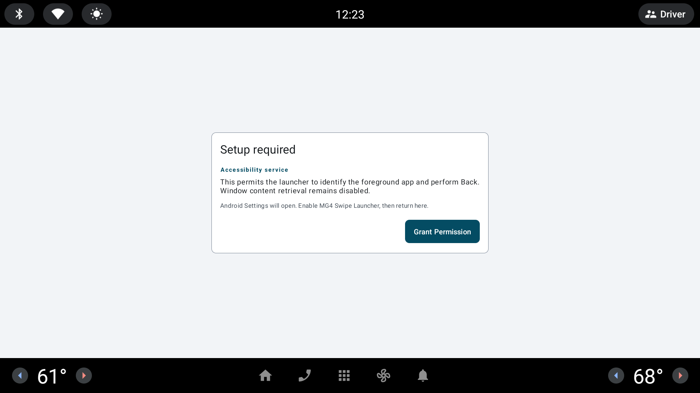

[Source code](https://github.com/malys/EVSwipe) · [Releases](https://github.com/malys/EVSwipe/releases) · [Issue tracker](https://github.com/malys/EVSwipe/issues)

Choose EVSwipe when you want a bottom-edge gesture to open a favourite app. A
second gesture performs Back, and you can swap the two sides.

The app needs Android accessibility and overlay access to recognise the gesture and perform
Back. It does not read or change vehicle settings.

## What you can configure

- Choose the target application.
- Decide whether Back belongs on the left or right.
- Keep the visible swipe labels until the layout is familiar.
- Do not use an overlay while the vehicle is moving.

It works with any chosen app and pairs well with EVLauncher.

Next: [set up the swipe shortcuts](/EVSuite_site/tutorial/launchers/#swipe-launcher).
